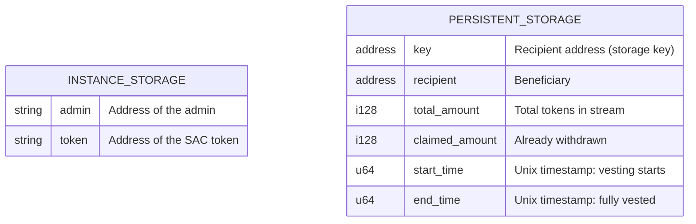

# Architecture Overview

## Contract Call Flow

```mermaid
flowchart TD
    A[Deployer] -->|deploy WASM| C[VestingVault Contract]
    A -->|init(admin, token)| C

    Admin[Admin Address] -->|create_stream(recipient, amount, start, end)| C
    C -->|token.transfer(admin → contract)| T[SAC Token Contract]

    Recipient[Recipient Address] -->|withdraw(recipient)| C
    C -->|token.transfer(contract → recipient)| T

    Anyone[Anyone] -->|claimable_amount(recipient) → i128| C
```

## Storage Layout



## Vesting Math

```
elapsed  = max(0, now - start_time)
duration = end_time - start_time
unlocked = total_amount * min(elapsed, duration) / duration
claimable = unlocked - claimed_amount
```

Integer division truncates (rounds down), always in favor of the contract.

## Component Descriptions

### `VestingVault` contract (`src/lib.rs`)

| Function | Auth | Description |
|---|---|---|
| `init` | — | One-time setup: stores admin + token addresses in instance storage |
| `create_stream` | admin | Validates params, stores `StreamState` in persistent storage, transfers tokens from admin into the contract |
| `claimable_amount` | — | Reads stream, computes `unlocked - claimed_amount` |
| `withdraw` | recipient | Transfers all claimable tokens to recipient, updates `claimed_amount` |

### `StreamState` struct (`src/types.rs`)

Stored in **persistent** storage keyed by `recipient: Address`. Each recipient can have at most one active stream.

### SAC Token Contract

An external [Stellar Asset Contract](https://developers.stellar.org/docs/smart-contracts/tokens) that the vault calls via `token::Client`. The vault holds the deposited tokens on behalf of recipients.

### GrantFox Milestone Payouts

For GrantFox-specific payout operations, see
[GRANTFOX_INTEGRATION.md](GRANTFOX_INTEGRATION.md). That guide maps approved
milestones to `create_stream`, `claimable_amount`, and `withdraw` calls without
changing the base contract interface.

## Security Properties

- **No reentrancy risk** — state is written before the external `token.transfer` call.
- **Per-recipient isolation** — each stream is independent; one recipient cannot affect another.
- **Admin cannot withdraw** — `withdraw` requires `recipient.require_auth()`.
- **Single initialization** — re-init panics on the second call.
